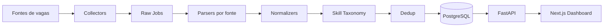

# JobScope Tech BR

> **Produto de dados sobre o mercado de vagas tech no Brasil.**  
> Coleta real, normalização de dados bagunçados, taxonomia de skills, deduplicação pragmática, API e dashboard.

<p align="left">
  
  
  
  
</p>

---

## Visão geral

O **JobScope Tech BR** é um projeto flagship de portfólio construído para transformar vagas tech dispersas e pouco estruturadas em um produto analítico navegável.

A ideia central é simples, mas forte: **não basta coletar vagas; é preciso transformar texto bagunçado em sinal de mercado útil**. Por isso, o projeto combina coleta real, parsing por fonte, normalização de campos, taxonomia simples de skills, deduplicação básica, persistência relacional, API e interface web.

O resultado desejado é um produto que pareça trabalho real de time, não apenas um exercício técnico. A aplicação deve ser capaz de responder perguntas como:

- quais skills aparecem com mais frequência;
- quais stacks dominam o mercado;
- como as vagas se distribuem por senioridade;
- quais modalidades de trabalho aparecem mais;
- quais combinações de skills se repetem;
- quais sinais o mercado emite para quem quer entrar ou se reposicionar.

---

## Problema que o projeto resolve

As vagas tech no Brasil estão espalhadas por múltiplas fontes, com descrições inconsistentes e pouca padronização.

Na prática, isso causa três problemas principais:

1. **Comparação difícil**  
   Títulos, descrições e requisitos mudam muito de uma empresa para outra.

2. **Dados pouco estruturados**  
   Skills aparecem misturadas com benefícios, contexto da empresa, requisitos e texto de marketing.

3. **Leitura de mercado lenta**  
   É trabalhoso responder perguntas simples sem ler centenas de vagas manualmente.

O JobScope existe para reduzir esse atrito e mostrar, de forma clara, o que o mercado está pedindo.

---

## Por que este projeto existe

Este projeto foi pensado para provar capacidade de construir um **data product end-to-end**.

Ele mostra que eu consigo:

- coletar dados reais;
- tratar dados bagunçados;
- modelar persistência;
- criar uma API útil;
- construir uma interface com UX clara;
- tomar decisões de escopo com disciplina;
- publicar um projeto com cara de produto real.

Em outras palavras: este projeto foi desenhado para funcionar como um ativo de carreira, não como um experimento isolado.

---

## O que o projeto quer provar

O **JobScope Tech BR** foi criado para demonstrar que eu consigo unir:

- **estatística aplicada** com leitura de padrões de mercado;
- **data engineering** com coleta e pipeline;
- **backend/API** com FastAPI e Postgres;
- **analytics** com taxonomia e agregações;
- **product thinking** com escopo firme;
- **UX** com uma interface clara e navegável;
- **documentação técnica** com narrativa de portfólio.

---

## O que entra na V1

A primeira versão será propositalmente enxuta.

### V1 inclui
- 2 fontes iniciais de vagas;
- coleta confiável e repetível;
- parser por fonte;
- normalização de senioridade, modalidade e localidade;
- taxonomia inicial de skills por dicionário + aliases;
- deduplicação pragmática;
- persistência em PostgreSQL;
- API mínima para consulta;
- dashboard com poucos gráficos, mas bons;
- tabela/lista de vagas;
- drawer ou página de detalhe;
- status básico do pipeline;
- seed/demo data;
- deploy público.

### V1 não inclui
- 3+ fontes;
- LLM para extração;
- NLP pesado;
- salary parsing sofisticado;
- auth;
- alertas;
- recomendação de vagas;
- matching de currículo;
- tempo real;
- arquitetura distribuída;
- qualquer feature bonita que não aumente a chance de terminar.

---

## Stack prevista

### Backend
- Python
- FastAPI
- SQLAlchemy
- Alembic
- Pydantic

### Data pipeline
- Python
- httpx / requests
- BeautifulSoup
- regex
- scripts CLI

### Banco
- PostgreSQL

### Frontend
- Next.js (App Router)
- TypeScript
- Tailwind CSS
- shadcn/ui
- gráficos leves

### Qualidade e dev
- pytest
- Ruff
- ESLint
- Docker Compose
- GitHub Actions

### Deploy
- Vercel para frontend
- Railway para backend e banco

---

## Arquitetura resumida



### Camadas do sistema

#### Coleta
Cada fonte é coletada separadamente, para reduzir acoplamento e facilitar manutenção.

#### Parsing
Cada coletor tem seu parser, responsável por converter o formato bruto em estrutura canônica.

#### Normalização
Campos como senioridade, modalidade e localidade são padronizados para permitir comparação.

#### Taxonomia
Skills são detectadas com dicionário, aliases e regras simples.

#### Persistência
PostgreSQL guarda tanto o dado bruto quanto o dado normalizado.

#### Serving
FastAPI expõe os dados por meio de endpoints mínimos e claros.

#### Interface
Next.js organiza a leitura dos dados em dashboard, lista e detalhe.

---

## Capacidades planejadas

### Dashboard
- total de vagas;
- empresas únicas;
- skills mais frequentes;
- senioridade;
- modalidade;
- localidades mais comuns.

### Lista de vagas
- filtros por senioridade;
- filtros por modalidade;
- filtros por skill;
- busca simples;
- ordenação básica;
- navegação para detalhe.

### Detalhe da vaga
- descrição tratada;
- skills detectadas;
- fonte original;
- link original;
- datas relevantes.

### Pipeline
- execução por fonte;
- coleta de novos dados;
- controle de duplicatas;
- status de saúde.

---

## Modelo de dados

### Entidades principais
- `sources`
- `collection_runs`
- `raw_jobs`
- `companies`
- `jobs`
- `skills`
- `job_skills`

### Campos essenciais da vaga
- título;
- empresa;
- senioridade;
- modalidade;
- localidade;
- fonte;
- link original;
- descrição tratada;
- skills detectadas;
- data de coleta;
- data da vaga, quando existir.

### Estratégia de persistência
O dado bruto é preservado em `raw_jobs`, para permitir auditoria e reprocessamento.  
O dado tratado vai para `jobs`, permitindo servir a aplicação com uma estrutura limpa e consistente.

---

## API prevista

### `GET /health`
Healthcheck da aplicação.

### `GET /jobs`
Listagem paginada de vagas com filtros.

### `GET /jobs/{id}`
Detalhe de uma vaga específica.

### `GET /stats`
Agregações principais para o dashboard.

### `GET /skills`
Lista de skills com contagem agregada.

### `GET /pipeline/status`
Status das execuções de coleta e saúde geral do pipeline.

---

## Taxonomia inicial de skills

A primeira versão da taxonomia será pragmática e transparente.

### Categorias iniciais
- `languages`
- `frameworks`
- `data`
- `cloud_infra`
- `databases`

### Exemplos de skills
- Python
- SQL
- JavaScript
- TypeScript
- Java
- Go
- FastAPI
- Django
- React
- Next.js
- Spark
- Airflow
- dbt
- AWS
- GCP
- Docker
- Kubernetes
- PostgreSQL
- MongoDB
- Redis

### Regra geral
Nada de classificação mágica.  
A detecção vai começar com dicionário, aliases e regras claras, porque isso é suficiente para a V1 e muito mais fácil de explicar, testar e manter.

---

## Deduplicação

A V1 vai usar uma estratégia simples e defensável:

- normalização básica de título e empresa;
- fingerprint determinístico;
- prevenção de duplicatas óbvias;
- rastreabilidade do dado bruto.

A prioridade aqui não é resolver deduplicação perfeita. A prioridade é impedir repetição grosseira sem criar uma solução complexa demais cedo demais.

---

## Estrutura do repositório

```text
jobscope-tech-br/
├── frontend/
│   ├── app/
│   ├── components/
│   ├── lib/
│   ├── public/
│   └── package.json
├── backend/
│   ├── app/
│   │   ├── api/
│   │   ├── models/
│   │   ├── schemas/
│   │   ├── collector/
│   │   ├── parser/
│   │   ├── normalizer/
│   │   ├── taxonomy/
│   │   ├── dedup/
│   │   └── pipeline/
│   ├── tests/
│   ├── scripts/
│   ├── seed/
│   └── migrations/
├── docs/
│   ├── product-requirements.md
│   ├── architecture.md
│   ├── roadmap.md
│   ├── data-model.md
│   ├── api-contract.md
│   ├── demo-script.md
│   └── case-study-draft.md
├── data/
├── assets/
├── .github/
├── README.md
├── LICENSE
├── CHANGELOG.md
├── CONTRIBUTING.md
├── .env.example
└── docker-compose.yml
```

---

## Roadmap

### Fase 0 — Preparação
- estrutura do repositório;
- documentação base;
- issues;
- milestones;
- CI mínima;
- ambiente local.

### Fase 1 — Base técnica mínima
- Postgres local;
- backend inicial;
- migration inicial;
- validação de fontes;
- primeiro coletor;
- persistência de raw jobs.

### Fase 2 — Pipeline principal
- parser por fonte;
- normalização;
- taxonomia;
- deduplicação;
- persistência de jobs.

### Fase 3 — Robustez
- segunda fonte;
- testes;
- ajustes de parser;
- status do pipeline.

### Fase 4 — API e frontend
- endpoints mínimos;
- dashboard;
- listagem;
- filtros;
- detalhe.

### Fase 5 — Publicação
- deploy;
- screenshots;
- vídeo demo;
- README final;
- narrativa pública.

### Fase 6 — Iteração pós-lançamento
- V1.1 enxuta;
- export CSV;
- melhoria da taxonomia;
- filtros mais refinados.

---

## Status atual

**Status:** em construção  
**Fase atual:** preparação do repositório e documentação base  
**Próximo passo:** criar estrutura inicial, iniciar backend e persistir os primeiros `raw_jobs`

---

## Instruções iniciais

### Requisitos locais
- Python 3.11+
- Node.js 20+
- Docker + Docker Compose
- Git

### Fluxo de inicialização
1. clonar o repositório;
2. subir o banco local;
3. criar o backend inicial;
4. aplicar migrations;
5. validar as fontes;
6. executar o primeiro coletor;
7. ver os dados brutos persistidos;
8. evoluir para parsing e normalização.

---

## Demo e screenshots

A V1 vai precisar de screenshots que provem que o projeto é real:

- dashboard desktop;
- dashboard mobile;
- lista de vagas com filtros;
- detalhe de vaga aberto;
- status do pipeline;
- documentação da API;
- terminal rodando a coleta.

---

## O que este projeto quer provar

Este projeto quer provar que eu consigo:

- construir um produto de dados real;
- trabalhar com dados imperfeitos;
- desenhar um pipeline simples e sólido;
- expor dados por API;
- criar uma experiência web clara;
- fazer decisões de escopo corretas;
- publicar algo com cara de trabalho profissional.

---

## Riscos conhecidos

- instabilidade das fontes;
- dados incompletos;
- ruído na taxonomia;
- duplicação entre fontes;
- tentação de inflar o escopo.

A estratégia do projeto é aceitar essas limitações e entregar uma V1 honesta, clara e terminável.

---

## Stack de valor para portfólio

Este projeto conversa bem com:
- GitHub;
- LinkedIn;
- entrevista técnica;
- case study;
- apresentação de portfólio;
- currículo;
- README com screenshots.

---

## Licença

Este projeto será disponibilizado sob licença MIT.

---

## Autor

**Seu Nome**  
GitHub: `[seu-link]`  
LinkedIn: `[seu-link]`  
Portfólio: `[seu-link]`

---

## Nota final

O JobScope Tech BR não quer parecer maior do que é.

Ele quer parecer **real**: tecnicamente honesto, visualmente claro, documentalmente forte e escopado o suficiente para terminar.
