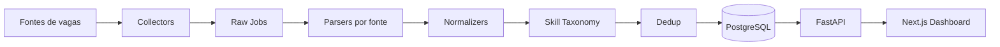

<div align="center">
  

  <h1>JobScope Tech BR</h1>

  <p><strong>Produto de dados sobre o mercado de vagas tech no Brasil</strong></p>
  <p><strong>Data product for the Brazilian tech job market</strong></p>

  <p>
    <a href="#pt-br">PT-BR</a> •
    <a href="#en">English</a> •
    <a href="#stack--tecnologias">Stack</a> •
    <a href="#arquitetura--architecture">Arquitetura</a> •
    <a href="#api-prevista--planned-api">API</a> •
    <a href="#autor--author">Autor</a>
  </p>

  <p>
    
    
    
    
    
    
  </p>

  <p>
    <a href="https://barujafe.vercel.app/"><strong>🌐 Portfólio</strong></a> •
    <a href="https://github.com/BarujaFe1"><strong>🐙 GitHub</strong></a> •
    <a href="https://www.linkedin.com/in/barujafe/"><strong>💼 LinkedIn</strong></a>
  </p>
</div>

---

<a id="pt-br"></a>

## 🇧🇷 PT-BR

## 📊 Visão geral

**JobScope Tech BR** é um projeto flagship de portfólio criado para transformar vagas tech dispersas, ruidosas e pouco estruturadas em um produto analítico navegável.

A ideia central é simples, mas forte: **não basta coletar vagas; é preciso transformar texto bagunçado em sinal de mercado útil**.

Por isso, o projeto combina coleta real, parsing por fonte, normalização de campos, taxonomia de skills, deduplicação pragmática, persistência relacional, API e interface web.

O resultado esperado é um produto que pareça trabalho real de time, e não apenas um exercício técnico.

> **Objetivo:** mostrar o que o mercado tech brasileiro está pedindo por meio de dados coletados, normalizados, classificados e visualizados com clareza.

---

## 🎯 Problema que resolve

As vagas tech no Brasil estão espalhadas por múltiplas fontes, com descrições inconsistentes e baixa padronização.

Na prática, isso cria três problemas principais:

### 1. Comparação difícil

Títulos, descrições, senioridades e requisitos variam muito entre empresas e plataformas.

### 2. Dados pouco estruturados

Skills aparecem misturadas com benefícios, contexto da empresa, requisitos obrigatórios, diferenciais e texto de marketing.

### 3. Leitura de mercado lenta

É trabalhoso responder perguntas simples sem ler centenas de vagas manualmente.

O **JobScope Tech BR** existe para reduzir esse atrito e mostrar, de forma clara, quais sinais o mercado está emitindo.

---

## 🧠 Perguntas que o produto responde

A aplicação deve ajudar a responder perguntas como:

- Quais skills aparecem com mais frequência?
- Quais stacks dominam o mercado?
- Como as vagas se distribuem por senioridade?
- Quais modalidades de trabalho aparecem mais?
- Quais localidades concentram oportunidades?
- Quais combinações de skills se repetem?
- Quais sinais são úteis para quem quer entrar ou se reposicionar na área tech?

---

## 💼 Por que este projeto existe

O JobScope foi pensado para provar capacidade de construir um **data product end-to-end**.

Ele demonstra:

- coleta de dados reais;
- tratamento de dados bagunçados;
- modelagem de persistência;
- criação de API útil;
- construção de interface com UX clara;
- disciplina de escopo;
- documentação técnica forte;
- narrativa de portfólio orientada a produto.

Em outras palavras: este projeto foi desenhado para funcionar como ativo de carreira, não como experimento isolado.

---

## ✅ O que entra na V1

A primeira versão será propositalmente enxuta, terminável e publicável.

### Inclui

- 2 fontes iniciais de vagas.
- Coleta confiável e repetível.
- Parser por fonte.
- Normalização de senioridade, modalidade e localidade.
- Taxonomia inicial de skills por dicionário e aliases.
- Deduplicação pragmática.
- Persistência em PostgreSQL.
- API mínima para consulta.
- Dashboard com poucos gráficos, mas bons.
- Tabela/lista de vagas.
- Drawer ou página de detalhe.
- Status básico do pipeline.
- Seed/demo data.
- Deploy público.

### Não inclui

- 3+ fontes.
- LLM para extração.
- NLP pesado.
- Salary parsing sofisticado.
- Autenticação.
- Alertas.
- Recomendação de vagas.
- Matching de currículo.
- Tempo real.
- Arquitetura distribuída.
- Features bonitas que não aumentam a chance de terminar.

---

## ✨ Capacidades planejadas

### Dashboard

- Total de vagas.
- Empresas únicas.
- Skills mais frequentes.
- Distribuição por senioridade.
- Distribuição por modalidade.
- Localidades mais comuns.

### Lista de vagas

- Filtro por senioridade.
- Filtro por modalidade.
- Filtro por skill.
- Busca simples.
- Ordenação básica.
- Navegação para detalhe.

### Detalhe da vaga

- Descrição tratada.
- Skills detectadas.
- Fonte original.
- Link original.
- Datas relevantes.
- Metadados do parsing.

### Pipeline

- Execução por fonte.
- Coleta de novos dados.
- Controle de duplicatas.
- Status de saúde.
- Histórico de coleta.

---

<a id="en"></a>

## 🇺🇸 English

## 📊 Overview

**JobScope Tech BR** is a flagship portfolio project created to transform scattered, noisy and poorly structured Brazilian tech job postings into a navigable analytical product.

The core idea is simple but strong: **collecting job posts is not enough; messy text must be transformed into useful market signals**.

The project combines real data collection, source-specific parsing, field normalization, skill taxonomy, pragmatic deduplication, relational persistence, API serving and a web interface.

The expected result is a product that feels like real team work, not just a technical exercise.

> **Goal:** reveal what the Brazilian tech market is asking for through data that is collected, normalized, classified and visualized clearly.

---

## 🎯 Problem solved

Tech job postings in Brazil are spread across multiple sources, with inconsistent descriptions and little standardization.

This creates three main problems:

### 1. Hard comparison

Titles, descriptions, seniority levels and requirements vary significantly across companies and platforms.

### 2. Poorly structured data

Skills are mixed with benefits, company context, required qualifications, nice-to-haves and marketing copy.

### 3. Slow market reading

It is hard to answer simple questions without manually reading hundreds of job posts.

**JobScope Tech BR** reduces this friction and makes market signals clearer.

---

## 🧠 Questions the product answers

The application should help answer questions such as:

- Which skills appear most often?
- Which stacks dominate the market?
- How are jobs distributed by seniority?
- Which work models appear most frequently?
- Which locations concentrate opportunities?
- Which skill combinations repeat?
- Which signals are useful for people trying to enter or reposition in tech?

---

## 💼 Why this project exists

JobScope was designed to prove the ability to build an **end-to-end data product**.

It demonstrates:

- real data collection;
- messy data handling;
- persistence modeling;
- useful API design;
- clear UX for data exploration;
- disciplined scope decisions;
- strong technical documentation;
- product-oriented portfolio narrative.

In other words: this project was designed as a career asset, not an isolated experiment.

---

## ✅ What goes into V1

The first version is intentionally lean, finishable and publishable.

### Included

- 2 initial job sources.
- Reliable and repeatable collection.
- Source-specific parser.
- Normalization of seniority, work model and location.
- Initial skill taxonomy using dictionary and aliases.
- Pragmatic deduplication.
- PostgreSQL persistence.
- Minimal query API.
- Dashboard with few but useful charts.
- Job table/list.
- Detail drawer or page.
- Basic pipeline status.
- Seed/demo data.
- Public deployment.

### Not included

- 3+ sources.
- LLM-based extraction.
- Heavy NLP.
- Sophisticated salary parsing.
- Authentication.
- Alerts.
- Job recommendation.
- Resume matching.
- Real-time processing.
- Distributed architecture.
- Attractive features that reduce the chance of shipping.

---

## ✨ Planned capabilities

### Dashboard

- Total jobs.
- Unique companies.
- Most frequent skills.
- Seniority distribution.
- Work model distribution.
- Most common locations.

### Job list

- Filter by seniority.
- Filter by work model.
- Filter by skill.
- Simple search.
- Basic sorting.
- Navigation to detail.

### Job detail

- Cleaned description.
- Detected skills.
- Original source.
- Original link.
- Relevant dates.
- Parsing metadata.

### Pipeline

- Execution by source.
- New data collection.
- Duplicate control.
- Health status.
- Collection history.

---

<a id="stack--tecnologias"></a>

## 🛠️ Stack / Tecnologias

### Backend

- **Python**
- **FastAPI**
- **SQLAlchemy**
- **Alembic**
- **Pydantic**

### Data pipeline

- **Python**
- **httpx / requests**
- **BeautifulSoup**
- **regex**
- **CLI scripts**

### Database

- **PostgreSQL**

### Frontend

- **Next.js App Router**
- **TypeScript**
- **Tailwind CSS**
- **shadcn/ui**
- Lightweight charts

### Quality and development

- **pytest**
- **Ruff**
- **ESLint**
- **Docker Compose**
- **GitHub Actions**

### Deploy

- **Vercel** for frontend
- **Railway** for backend and database

---

<a id="arquitetura--architecture"></a>

## 🏗️ Arquitetura / Architecture


```mermaid
flowchart LR
    A[Fontes de vagas] --> B[Collectors]
    B --> C[Raw Jobs]
    C --> D[Parsers por fonte]
    D --> E[Normalizers]
    E --> F[Skill Taxonomy]
    F --> G[Dedup]
    G --> H[(PostgreSQL)]
    H --> I[FastAPI]
    I --> J[Next.js Dashboard]
```

### Camadas do sistema / System layers

| Camada | Responsabilidade |
|---|---|
| Coleta | Cada fonte é coletada separadamente para reduzir acoplamento |
| Parsing | Cada coletor tem parser próprio para converter bruto em estrutura canônica |
| Normalização | Padroniza senioridade, modalidade e localidade |
| Taxonomia | Detecta skills por dicionário, aliases e regras simples |
| Persistência | PostgreSQL guarda dado bruto e normalizado |
| Serving | FastAPI expõe endpoints mínimos e claros |
| Interface | Next.js organiza leitura em dashboard, lista e detalhe |

---

## 🔄 Data Flow / Fluxo de dados

```txt
Job Sources
   ↓
Collectors
   ↓
Raw Jobs
   ↓
Source Parsers
   ↓
Normalizers
   ↓
Skill Taxonomy
   ↓
Deduplication
   ↓
PostgreSQL
   ↓
FastAPI
   ↓
Next.js Dashboard
```

---

## 🧬 Modelo de dados / Data model

### Entidades principais / Main entities

- `sources`
- `collection_runs`
- `raw_jobs`
- `companies`
- `jobs`
- `skills`
- `job_skills`

### Campos essenciais da vaga / Essential job fields

- title;
- company;
- seniority;
- work model;
- location;
- source;
- original link;
- cleaned description;
- detected skills;
- collected date;
- job publication date, when available.

### Estratégia de persistência / Persistence strategy

Raw data is preserved in `raw_jobs` for auditing and reprocessing.

Cleaned data goes to `jobs`, allowing the application to serve consistent structured records.

---

<a id="api-prevista--planned-api"></a>

## 🔗 API prevista / Planned API

### `GET /health`

Application health check.

### `GET /jobs`

Paginated job list with filters.

### `GET /jobs/{id}`

Detail of a specific job posting.

### `GET /stats`

Main aggregations for the dashboard.

### `GET /skills`

Skill list with aggregated counts.

### `GET /pipeline/status`

Collection execution status and general pipeline health.

---

## 🧠 Taxonomia inicial de skills / Initial skill taxonomy

The first version of the taxonomy is pragmatic and transparent.

### Initial categories

- `languages`
- `frameworks`
- `data`
- `cloud_infra`
- `databases`

### Skill examples

- Python
- SQL
- JavaScript
- TypeScript
- Java
- Go
- FastAPI
- Django
- React
- Next.js
- Spark
- Airflow
- dbt
- AWS
- GCP
- Docker
- Kubernetes
- PostgreSQL
- MongoDB
- Redis

### General rule

No magic classification.

Detection starts with dictionaries, aliases and clear rules because this is enough for V1 and much easier to explain, test and maintain.

---

## 🧹 Deduplicação / Deduplication

V1 uses a simple and defensible strategy:

- basic normalization of title and company;
- deterministic fingerprint;
- prevention of obvious duplicates;
- traceability of raw data.

The priority is not perfect deduplication. The priority is to prevent gross repetition without overengineering the system too early.

---

## 📁 Estrutura do repositório / Repository structure

```txt
jobscope-tech-br/
├── frontend/
│   ├── app/
│   ├── components/
│   ├── lib/
│   ├── public/
│   └── package.json
├── backend/
│   ├── app/
│   │   ├── api/
│   │   ├── models/
│   │   ├── schemas/
│   │   ├── collector/
│   │   ├── parser/
│   │   ├── normalizer/
│   │   ├── taxonomy/
│   │   ├── dedup/
│   │   └── pipeline/
│   ├── tests/
│   ├── scripts/
│   ├── seed/
│   └── migrations/
├── docs/
│   ├── product-requirements.md
│   ├── architecture.md
│   ├── roadmap.md
│   ├── data-model.md
│   ├── api-contract.md
│   ├── demo-script.md
│   └── case-study-draft.md
├── data/
├── assets/
├── .github/
├── README.md
├── LICENSE
├── CHANGELOG.md
├── CONTRIBUTING.md
├── .env.example
└── docker-compose.yml
```

---

## 🚀 Quick Start / Início rápido

### Requisitos locais / Local requirements

- Python 3.11+
- Node.js 20+
- Docker + Docker Compose
- Git

### Fluxo inicial recomendado / Recommended initial flow

```bash
git clone https://github.com/BarujaFe1/jobscope-tech-br.git
cd jobscope-tech-br
docker compose up -d
```

Backend:

```bash
cd backend
python -m venv .venv

# Windows
.venv\Scripts\activate

# Linux/macOS
source .venv/bin/activate

pip install -r requirements.txt
```

Frontend:

```bash
cd frontend
npm install
npm run dev
```

Planned access:

```txt
Frontend: http://localhost:3000
Backend:  http://localhost:8000
API Docs: http://localhost:8000/docs
```

---

## 🗺️ Roadmap

### Fase 0 — Preparação

- [ ] Estrutura do repositório.
- [ ] Documentação base.
- [ ] Issues e milestones.
- [ ] CI mínima.
- [ ] Ambiente local.

### Fase 1 — Base técnica mínima

- [ ] Postgres local.
- [ ] Backend inicial.
- [ ] Migration inicial.
- [ ] Validação de fontes.
- [ ] Primeiro coletor.
- [ ] Persistência de raw jobs.

### Fase 2 — Pipeline principal

- [ ] Parser por fonte.
- [ ] Normalização.
- [ ] Taxonomia.
- [ ] Deduplicação.
- [ ] Persistência de jobs.

### Fase 3 — Robustez

- [ ] Segunda fonte.
- [ ] Testes.
- [ ] Ajustes de parser.
- [ ] Status do pipeline.

### Fase 4 — API e frontend

- [ ] Endpoints mínimos.
- [ ] Dashboard.
- [ ] Listagem.
- [ ] Filtros.
- [ ] Detalhe.

### Fase 5 — Publicação

- [ ] Deploy.
- [ ] Screenshots.
- [ ] Vídeo demo.
- [ ] README final.
- [ ] Narrativa pública.

### Fase 6 — Iteração pós-lançamento

- [ ] V1.1 enxuta.
- [ ] Export CSV.
- [ ] Melhoria da taxonomia.
- [ ] Filtros mais refinados.

---

## 📸 Demo e screenshots / Demo and screenshots

A V1 deve incluir screenshots que provem que o produto é real:

- dashboard desktop;
- dashboard mobile;
- lista de vagas com filtros;
- detalhe de vaga aberto;
- status do pipeline;
- documentação da API;
- terminal rodando a coleta.

---

## ⚠️ Riscos conhecidos / Known risks

- Instabilidade das fontes.
- Dados incompletos.
- Ruído na taxonomia.
- Duplicação entre fontes.
- Tentação de inflar o escopo.

A estratégia do projeto é aceitar essas limitações e entregar uma V1 honesta, clara e terminável.

---

## 💼 Valor para portfólio / Portfolio value

Este projeto conversa bem com:

- GitHub;
- LinkedIn;
- entrevista técnica;
- case study;
- apresentação de portfólio;
- currículo;
- README com screenshots.

Ele demonstra união entre:

- estatística aplicada;
- data engineering;
- backend/API;
- analytics;
- product thinking;
- UX;
- documentação técnica.

---

## 🤝 Contribuição / Contributing

Contributions are welcome, especially around:

- data collection reliability;
- parsing quality;
- skill taxonomy;
- deduplication strategy;
- API design;
- dashboard UX;
- documentation.

Recommended flow:

```bash
git checkout -b feature/your-feature
git commit -m "feat: describe your change"
git push origin feature/your-feature
```

Then open a Pull Request.

---

<a id="autor--author"></a>

## 👤 Autor / Author

Developed by **Felipe Baruja**.

- **Portfolio:** [https://barujafe.vercel.app/](https://barujafe.vercel.app/)
- **GitHub:** [github.com/BarujaFe1](https://github.com/BarujaFe1)
- **LinkedIn:** [linkedin.com/in/barujafe](https://www.linkedin.com/in/barujafe/)

---

## 📄 Licença / License

MIT License.

See [LICENSE](./LICENSE) for details.

---

<div align="center">
  <p><strong>JobScope Tech BR</strong></p>
  <p>Vagas dispersas entram. Sinais de mercado saem.</p>
  <p><em>Scattered job posts in. Market signals out.</em></p>
</div>
