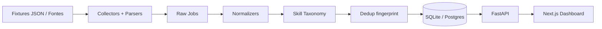

# Architecture — JobScope Tech BR

## Visão

JobScope é um **data product** enxuto: transforma vagas tech ruidosas em registros estruturados e os serve via API + dashboard.

## Camadas

| Camada | Onde | Responsabilidade |
|---|---|---|
| Collectors/Parsers | `backend/app/pipeline/` | Ingestão por fonte; parser próprio por contrato |
| Domain | `backend/app/domain/` | Normalização, taxonomia, dedup (puro, testável) |
| Persistence | `backend/app/models/` | SQLAlchemy models |
| Serving | `backend/app/api/` + `services/` | Endpoints e queries |
| UI | `frontend/src/` | Dashboard, lista, detalhe, pipeline |

## Fontes V1

V1 usa **fixtures JSON** (`data/fixtures/`) como duas fontes:

- `fixture_board_a` — campos estruturados (ATS-like)
- `fixture_board_b` — texto mais ruidoso

Isso evita scraping frágil/ToS na demo pública, mantendo o mesmo pipeline que coletores reais plugarão depois.

## Persistência

- **Default:** SQLite (`DATABASE_URL=sqlite:///./data/jobscope.db`) para DX zero-friction.
- **Opcional:** PostgreSQL via `docker compose up -d` e `DATABASE_URL` Postgres.
- Raw (`raw_jobs`) + limpo (`jobs`) para auditoria e reprocessamento.
- Dedup por `fingerprint` SHA-256 de título+empresa normalizados.

## API

- `GET /health`
- `GET /jobs` (filtros: seniority, work_model, skill, q)
- `GET /jobs/{id}`
- `GET /stats`
- `GET /skills`
- `GET /pipeline/status`
- `POST /pipeline/run`

## Frontend

Next.js App Router consome a API. Se a API estiver offline e `NEXT_PUBLIC_DEMO_MODE=true`, cai para snapshot embutido — útil para preview na Vercel sem backend.

## Decisões fora de escopo (V1)

Sem auth, sem LLM, sem tempo real, sem matching de currículo.
